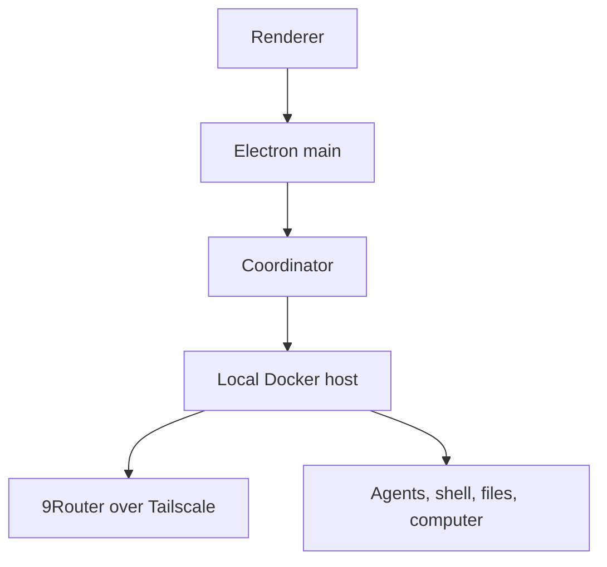

# Grok Bot 0.18 — reconstructed and extended


This repository is an unofficial, source-oriented reconstruction of the
publicly shipped Grok Bot 0.18.0 desktop app. The reviewed build path supports
macOS arm64 and an unsigned, local-only Windows x64 portable directory.

The project began as an attempt to understand how the desktop app was put
together. It now contains readable TypeScript implementations of its Electron,
host, coordinator, local-execution, protocol, and renderer boundaries, plus a
deterministic toolchain for turning those sources back into a working macOS
application.

The Windows portable build also has a login-independent **Local 9Router
workspace**. In that mode 9Router supplies model inference while an owned local
Docker VM supplies Grok Bot's agent, shell, file, and computer capabilities. It
does not create or emulate a Cursor account session.

It also adds a few practical experiments:

- an inference router for Cursor, Claude Code, Codex, OpenRouter, and local
  OpenAI-compatible APIs such as 9Router;
- Grok Bot plugin/MCP tools across the routed providers;
- local usage tracking for routed inference;
- an optional local Docker sandbox in place of the remote box, including a
  Windows Local 9Router workspace that does not require Cursor sign-in; and
- a reconstructed settings surface integrated into the polished shipped UI.

This is a hacking and research project, not Anysphere's original monorepo and
not an official Grok Bot release. It remains a reconstruction of the pinned
0.18.0 application; the Local 9Router workspace does not make it the latest
official Grok Bot. Names and module boundaries inferred from a compiled
application may differ from the original source.

## What is in the repository?

The checked-in tree contains the reviewed reconstruction, tests, manifests,
build scripts, and Git LFS preservation copies of the original macOS arm64 and
Windows x64 installers. It deliberately does **not** commit the extracted
upstream application, build output, local credentials, or the large forensic
recovery workspace.

The public Grok Bot 0.18.0 application is instead treated as a pinned build
input. During bootstrap, the toolchain downloads it, verifies its SHA-256
identity, and extracts the pieces required to assemble the reconstruction.

The resulting macOS app is a hybrid by design:

- application runtimes are compiled from the readable sources under `source/`;
- the polished shipped renderer remains the UI baseline;
- a narrow deterministic transform adds the reconstructed Router settings UI;
- original and patched renderer chunk hashes are recorded and verified; and
- the finished app uses a separate bundle identifier and an ad-hoc signature.

The upstream app installed on the machine is never overwritten.

### Why retain the shipped renderer?

The distributed application did not include the original frontend source or
source maps. It contained optimized, minified production JavaScript and CSS
chunks: enough to inspect behavior and recover contracts, but not the authored
React components, names, comments, file structure, or design-system source.

Recreating the complete frontend with the same polish and behavior would have
been a separate, much larger reverse-engineering project. It was not a realistic
goal for a weekend build. The practical choice for the polished macOS package
was therefore to reconstruct the runtime and control-plane code, retain the
checksum-pinned shipped renderer, and make the smallest auditable UI patch
needed for the new Router settings. The Windows portable path instead packages
the reviewed clean-source renderer so OpenAI-compatible/9Router settings remain
in the normal build graph rather than a platform-specific minified patch.

`frontend/` is a readable partial reconstruction and design workspace. It is
useful for understanding UI contracts and experimenting with clean components,
but it should not be mistaken for Anysphere's missing original frontend source
or a pixel-perfect replacement for the packaged renderer.

## Preserved original installers

Research copies of the exact 0.18.0 installers live under
`research-archives/original/0.18.0/` and are stored with Git LFS:

| Platform | File | SHA-256 |
| --- | --- | --- |
| macOS arm64 | `macos-arm64/Grok_Bot_0.18.0.dmg` | `a253ccd8aab01e083f9812a0264354c5034d8ba7f0610bbb557e82ae77d203eb` |
| Windows x64 | `windows-x64/Grok_Bot_0.18.0_Setup.exe` | `464079a15ef5fa8b61ccea8fffcc78f63cfcf6df65fb0ad5e725d8b95f7e437e` |

See [research-archives/README.md](research-archives/README.md) for source URLs,
sizes, verification commands, and the machine-readable artifact manifest.

## Current features

### Inference Router

Open **Settings → Router** to choose the backend used for new turns:

| Provider | Authentication | Tool support |
| --- | --- | --- |
| Cursor | Existing Grok Bot/Cursor session | Native Grok Bot tools and plugins |
| Claude Code | Existing Claude Code login | Routed Grok Bot MCP tools |
| Codex | Existing local ChatGPT/Codex login | Direct Responses transport with Grok Bot tools |
| OpenRouter | API key saved through the desktop secrets bridge | Grok Bot tool-execution loop |
| OpenAI-compatible / 9Router | Dedicated OS-encrypted proxy/client API key | Native agents, shell, files, and computer in the Local Docker workspace; account-only cloud features stay unavailable |

Cursor is the default. Claude Code and Codex do not require separate API keys
when their local clients are already authenticated. The application preserves
streaming responses, thinking state, reactions, rich plugin mentions, and MCP
tool execution across routed conversations.

#### 9Router / OpenAI-compatible setup

Use the **current stable 9Router release** (v0.5.35 when this path was reviewed).
On a fresh Windows portable profile, choose **Configure 9Router** on the
sign-in screen; otherwise open **Settings → Router**. Select
**OpenAI-compatible / 9Router** (the internal provider ID is `cli-proxy`). Save
the 9Router **proxy/client API key** (not its management key). If the exact
model ID is not known, first save the URL and key with the model blank, select
**Test & load models**, choose a model, and save again. Manual model entry
remains available because 9Router's `/v1/models` result can omit free or
no-auth models.

Chat Completions is the default protocol because it currently has the broadest
9Router compatibility. Auto also uses Chat Completions first. Explicit
Responses remains available for non-native routes, but the Local Docker native
agent path rejects it because tool-call replay has not been verified there. Use
only authenticated `/v1` endpoints; the `/codex`
rewrite is intentionally rejected. Plain HTTP is denied by default outside
loopback. The separate **Allow HTTP over Tailscale** switch permits only literal
Tailscale IP addresses; it does not permit arbitrary private or public HTTP
hosts. MagicDNS names are deliberately rejected for HTTP. Remote DNS names
require HTTPS and the separate HTTPS opt-in. Numeric-range validation does not
prove which Windows route is active, so confirm `tailscale ping 100.112.10.8`
succeeds before enabling plain HTTP.

The 9Router key is stored in its own fixed-purpose Electron `safeStorage` file.
It is never placed in user secrets, box-secret synchronization, environment
variables, settings, renderer status responses, or transcripts. If OS secure
storage is unavailable, it is held only in memory for the current session.
Immediately before a local native turn, the authenticated local gateway gives
the Docker host a short-lived, memory-only credential lease. The host cannot
read a prior lease back through that gateway and does not persist it. Changing
the endpoint origin (scheme, host, or port) does not reuse the previous key;
the user must enter the key again.

The login-free workspace exposes the local agent runtime and its shell, file,
and computer tools. It does not fabricate a Cursor login, so shared rooms,
remote boxes, account-backed plugins, billing, and other cloud/account-only
features remain unavailable until a real account session exists.

**Usage & Billing** shows the locally recorded request and token totals for
providers that return usage data. These figures are activity records, not an
authoritative provider invoice.

### Local Docker sandbox

The Router page also has a **Use local Docker VM** toggle. When enabled, Grok
Bot runs its box host and execution daemon in an owned local container instead
of connecting to the remote sandbox.

The container:

- pins the reviewed linux/amd64 sandbox image by immutable manifest digest;
- publishes only gateway/VNC ports `1340`, `6080`, and `6081` to Windows
  loopback; execution/control ports `1337`, `1339`, and `8790` are not
  published to the host;
- mounts the reviewed host bundle and stock-daemon launcher read-only and
  replaces the owned container when their content hashes change;
- in standalone 9Router mode, runs the stock Computer-capable model-facing
  daemon as the non-root `box` user with no effective capabilities and
  `no_new_privs`; its directly spawned window forks inherit that identity, and
  this login-free model path has no root shell;
- gives only the root host process a read-only, root-owned gateway-token volume
  that the model-facing daemon cannot read;
- uses a short-lived in-memory 9Router credential lease in the login-free
  workspace, or the user's existing provider authentication where needed;
- omits host Codex/Claude credential mounts, host-control environment values,
  and raw-packet capture in standalone 9Router mode;
- is validated before the coordinator connects; and
- is stopped or replaced through the same settings lifecycle.

Docker Desktop, or another compatible local Docker daemon, must be running.
Remote mode remains the default for account-backed operation. The no-login
Windows Local 9Router workspace requires **Use local Docker VM** to be enabled.
These controls do not defend against a Windows or Docker administrator, and an
agent in the box intentionally retains control of its own workspace and
browser. Startup live-attests the primary model daemon; later window forks rely
on inherited restrictions and are not individually live-attested.

## Requirements

All builds require Node.js 26.5.x and Git LFS. macOS packaging requires Apple
Silicon and Xcode Command Line Tools. Windows packaging requires Windows 10/11
x64; the exact 7-Zip extractor is supplied by the locked `7zip-bin` dependency.
Docker Desktop is optional for other routes but required for the full
login-independent Local 9Router workspace.

## macOS quick start

```sh
git clone <your-repository-url>
cd grok-bot-0.18-reconstructed
git lfs install
git lfs pull
npm ci
npm run bootstrap
npm run check
npm run package
open "dist/Grok Bot 0.18 Reconstructed.app"
```

`npm run bootstrap` first uses the Git LFS preservation copy of the pinned
0.18.0 DMG. If that archive is absent, it falls back to the original public URL;
`GROK_BOT_018_APP` can also point to an existing application copy. Bootstrap
verifies both the DMG and `app.asar`, caches the matching Electron runtime, and
hydrates the ignored `src/app/dist` build input.

`npm run package` compiles the reconstructed runtimes, applies the narrow
renderer/settings transform, creates the app bundle, assigns the reconstructed
bundle identity, ad-hoc signs it, and verifies the result. Output is written to:

```text
dist/Grok Bot 0.18 Reconstructed.app
```

Reconstructed packages disable the upstream updater at the packaging boundary
and default upstream Sentry and telemetry emission off. Explicitly supplied
environment configuration is still respected.

## Windows x64 local portable build

The Windows path intentionally produces a directory, not an installer. It
checksum-verifies the preserved Setup executable, extracts it with the pinned
`7zip-bin@5.2.0` binary without executing NSIS, validates the upstream
`app.asar`, Electron carrier, signer, and every unpacked native module as PE
x86-64, then replaces the application payload with the clean-source
reconstruction.

Run the following in PowerShell or a Developer Command Prompt:

```powershell
git lfs install
git lfs pull --include="research-archives/original/0.18.0/windows-x64/Grok_Bot_0.18.0_Setup.exe" --exclude=""
npm ci
npm run bootstrap:windows
npm run typecheck
npm run source:typecheck
npm run test:windows
npm run package:windows
npm run verify:windows
npm run smoke:windows
```

The output is:

```text
dist/Grok Bot 0.18 Reconstructed-win32-x64/
  Grok Bot 0.18 Reconstructed.exe
```

`package:win` and `package-windows` are aliases for `package:windows`.
`smoke:windows` launches the packaged executable with a new temporary profile,
waits for the clean renderer, and verifies that Router settings are reachable.
The normal repository check performs the same bounded launch on
`windows-latest` and discards the binary.

Repository owners can run **Windows owner draft release** after explicitly
enabling Actions on a new fork. That workflow repeats the source, package, and
fresh-profile launch checks, creates a ZIP, re-extracts it into a clean temporary
directory, repeats verification and launch smoke, produces checksums and an
SBOM, and attaches the exact files to an unpublished Draft Release. It never
publishes a public release automatically. The draft remains subject to the
rights and signing review described below.

### Windows login-free Local 9Router workspace

This is the reviewed path for using the reconstructed Windows app without a
Cursor login while retaining local agents and computer tools. Before starting,
make sure all of the following are true:

- Windows 10/11 x64 is running the reconstructed portable app;
- Docker Desktop is installed, running, and able to start Linux containers;
- this Windows PC can reach the 9Router server over Tailscale at the literal IP
  `100.112.10.8`;
- the server runs the current stable 9Router release (v0.5.35 when reviewed)
  and exposes its authenticated `/v1` API on port `20128`;
- a 9Router proxy/client API key has been issued; and
- at least one exact model ID is known or is returned by `/v1/models`.

Configure the workspace as follows:

1. Start Docker Desktop, confirm Tailscale is connected, and run `tailscale
   ping 100.112.10.8` from Windows. Do not enable plain HTTP if that check does
   not reach the intended tailnet peer.
2. On a fresh profile, select **Configure 9Router** on the sign-in screen. On an
   existing profile, open **Settings → Router**.
3. Under **Route agent requests through**, select **OpenAI-compatible /
   9Router** (`cli-proxy`).
4. Set **Base URL** to `http://100.112.10.8:20128/v1` and enable **Allow HTTP
   over Tailscale**. Use the numeric IP exactly; an HTTP MagicDNS hostname is
   rejected.
5. Enter the issued proxy/client API key and leave **Chat Completions** selected
   (or use **Auto**) for the native agent and computer tool loop. Do not select
   explicit **Responses** for the Local Docker workspace.
6. If the exact model ID is known, enter it and select **Save 9Router**. If it
   is not known, leave the model blank, save the URL and key, select **Test &
   load models**, choose a returned model, and select **Save 9Router** again. A
   manual model value remains valid when the models response omits it.
7. Enable **Use local Docker VM**. The workspace becomes available when the
   provider is `cli-proxy`, a credential and exact model ID are configured,
   Chat Completions or Auto is selected, and the local Docker runtime is
   selected.

No Cursor sign-in is needed for this local workspace. 9Router performs model
inference; the Docker host performs agent orchestration, shell commands, file
operations, and computer/browser actions. Cursor-backed remote boxes, shared
rooms, account billing, and other cloud/account-only features do not become
available merely because this workspace is ready.

For a same-PC 9Router deployment, the loopback default remains
`http://127.0.0.1:20128/v1`. HTTP hostnames, including `localhost`, are
rejected; use the literal loopback address. The proxy/client API key is a
credential; on Windows its store is protected with a real DACL (current user,
SYSTEM, and Administrators), not a POSIX `0600` claim. The shared credential
helper enforces and re-verifies that boundary.

### Windows trust and identity boundary

The portable output is unofficial and unsigned as a reconstructed
distribution. Renaming the retained upstream Electron executable does not make
the reconstructed directory an upstream-signed product. No NSIS installer,
code-signing certificate, updater metadata, or automatic public release is
provided; complete a separate rights and signing review before redistribution.

The Windows build uses a distinct product/package/executable name, defaults to
`%APPDATA%\Grok Bot 0.18 Reconstructed`, hard-disables the official updater,
removes updater executables/configuration, and does not register the inherited
`sand:` callback. That default avoids taking the official app's protocol
association. Consequently, a fresh isolated profile does not use Cursor's
desktop OAuth callback; 9Router/OpenAI-compatible mode is the supported
Cursor-account-independent first-run path for this portable build. It still
requires the dedicated 9Router proxy/client API key described above.

## Architecture



The diagram shows the login-free Windows path. Electron main owns settings and
the OS-encrypted key store; the coordinator passes a short-lived lease over the
authenticated local gateway; and the Docker host combines 9Router inference
with the native local toolset. Account-backed provider and remote-box paths
remain separate and continue to require their real authentication.

The main source areas are:

- `source/electron-main/` — desktop lifecycle, settings, auth, box connectors,
  coordinator ownership, and RPC handlers;
- `source/electron-preload/` — the narrow trusted bridge exposed to the UI;
- `source/host/` — inference, tools, MCP, settings, and turn execution;
- `source/node-agent-coordinator/` — transcript routing, streaming activity,
  reactions, and the routed MCP bridge;
- `source/shared/` — shared contracts, settings, protocol, and provider helpers;
- `frontend/` — readable React/TypeScript renderer reconstruction and design
  workspace;
- `scripts/` — bootstrap, compilation, renderer patching, packaging, signing,
  and verification; and
- `tests/` — publication and router regressions.

See [docs/ARCHITECTURE.md](docs/ARCHITECTURE.md) for more detail.

## Development commands

```sh
npm test                  # focused regression tests
npm run typecheck         # renderer TypeScript
npm run source:typecheck  # runtime TypeScript
npm run frontend:build    # build the readable renderer reconstruction
npm run package           # build, sign, and verify the macOS app
npm run verify            # verify an existing packaged app
npm run smoke             # bounded native smoke check
npm run package:windows   # local unsigned Windows x64 portable directory
npm run verify:windows    # structural/hash/native verification of that directory
npm run smoke:windows     # fresh-profile packaged Windows launch + Router reachability
npm run publication:check # prove a fresh-history export is lossless
```

Generated directories including `.cache`, `.build`, `dist`, `src/app/dist`,
`recovered`, `recovery`, and local probe roots are ignored.

## Project status

The app launches and the core reconstructed flows are usable, including routed
inference, connected plugins, and the local Docker sandbox. This is still an
experimental reconstruction: it targets the pinned 0.18.0 macOS/arm64 and
Windows/x64 carriers, depends on external provider sessions or a configured
OpenAI-compatible endpoint, and does not promise compatibility with future
Grok Bot versions.

For changes, read [CONTRIBUTING.md](CONTRIBUTING.md). For the clean-history
export procedure, see [docs/PUBLISHING.md](docs/PUBLISHING.md). Technical
provenance and retained upstream boundaries are described in
[PROVENANCE.md](PROVENANCE.md) and [NOTICE.md](NOTICE.md).
