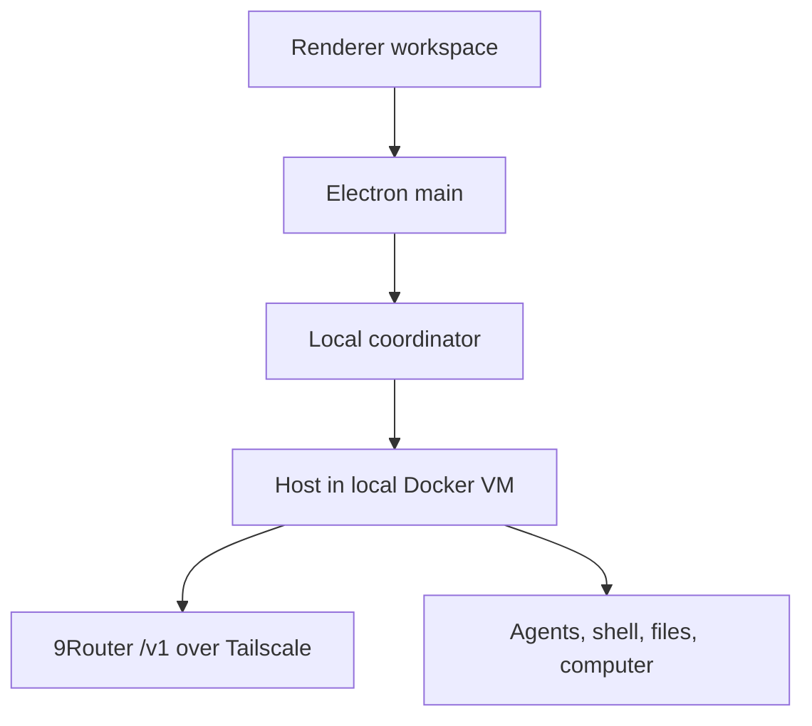

# Architecture

The repository keeps two editable source roots:

- `source/` contains the Electron main, host, coordinator, local-exec, shared,
  and protocol reconstruction.
- `frontend/` contains the React renderer reconstruction.

This architecture is an unofficial reconstruction of the pinned Grok Bot
0.18.0 application. New routing and local-workspace features extend that
reconstruction; they do not make it the latest official Grok Bot or reproduce
features that exist only in later official releases.

## Windows Local 9Router workspace

The login-free Windows mode separates model inference from tool execution:



9Router supplies the OpenAI-compatible model stream. The existing native host
inside the owned Docker VM supplies agent orchestration and the shell, file,
and computer/browser toolset. This preserves the reconstructed desktop's local
agent workflow: the model can request tools through the inference stream, but
the Docker host executes their effects locally rather than asking 9Router to
execute them.

The local workspace becomes eligible only when all three existing settings
surfaces agree:

- inference provider: **OpenAI-compatible / 9Router** (`cli-proxy`);
- box runtime: **Use local Docker VM** (`local-docker`); and
- 9Router status: a proxy/client API key and non-empty exact model ID are
  configured with Chat Completions or Auto, not explicit Responses.

Manual model entry keeps the settings surface usable when `/v1/models` is
empty. Before the local workspace is published as ready, the Docker host makes
an authenticated `/v1/models` request from inside the container; a URL that is
reachable only from Electron main therefore fails closed.

The renderer represents that state with the internal workspace identity
`local:9router`. It is a workspace capability, not an authentication record.
Electron main and the coordinator do not synthesize a `logged-in` Cursor
status, and the local connector does not request a Cursor inference credential
for this provider/runtime combination. Account-authorized RPCs therefore stay
closed.

The standalone container is created without host `.codex`/`.claude` mounts or
a Cursor inference-credential mount and with `NET_RAW` dropped. Switching
between standalone 9Router and credential-bearing local provider modes changes
the container labels and forces a recreation, so a stale mount is not carried
across the boundary. Its reviewed linux/amd64 base image is selected by an
immutable manifest digest; updating the former `sand-box-latest` source is an
explicit code, test, and review change rather than an implicit runtime pull.

The pinned image's supervisor remains responsible for the actual stock native
daemon that provides Computer support. For standalone 9Router, a read-only
replacement for its launcher runs the model-facing primary daemon as the
image's `box` user with `CapEff=0` and `NoNewPrivs=1`; window/fork daemons are
directly spawned beneath that process and inherit the same restrictions. The
readiness path attests the primary `/exec-daemon/node /exec-daemon/index.js
serve --port 1337` process and checks that `box` can write the workspace but
cannot read the gateway token. It does not mistake the separately staged
reconstructed execution-daemon source for the stock listener, and this
login-free path does not provide a model-facing root shell.

The host plane deliberately remains root and reads its gateway token from a
root-owned mode-`0600` named volume mounted read-only. Model child environments
scrub gateway, inference-renewal, product, egress, and local-generation control
credentials. Ports `1337`, `1339`, and `8790` are internal-only; the gateway
and Computer display ports `1340`, `6080`, and `6081` are published only on
Windows loopback. The dedicated ICC-disabled bridge rejects already attached
foreign containers, but neither it nor the owned labels are a boundary against
a Windows/Docker administrator. A same-box agent is intentionally allowed to
control its workspace and browser. Primary startup is live-attested; later
forks rely on inherited restrictions, and target-Windows Docker Desktop E2E
verification remains a release check rather than something source tests can
prove.

The reviewed Windows configuration requires Docker Desktop to be running and
the Windows host to have Tailscale access to the literal server address. For
the target server described by this branch, the API root is:

```text
http://100.112.10.8:20128/v1
```

The user selects a model exposed by 9Router, saves the issued proxy/client API
key, enables **Allow HTTP over Tailscale**, and selects the local Docker VM.
The server must run the current stable 9Router release (v0.5.35 when reviewed).

### Prompt and credential path

The renderer receives only redacted configuration status. The proxy/client API
key remains in Electron main's fixed-purpose OS-protected secret store. During
workspace readiness, the coordinator reads the normalized configuration once,
installs it through the bearer-authenticated desktop-to-host lease setter, then
invokes the in-container `/v1/models` probe without a config or key argument.
The host reads only its short-lived memory lease and returns only outcome and
latency. For a native prompt, the coordinator refreshes the same memory-only
lease immediately before dispatch:

- the lease expires after 30 minutes and is refreshed immediately before each
  later prompt;
- the gateway has an install operation but no operation that reads the key
  back;
- the host never writes the lease to settings, environment variables,
  transcripts, box-secret synchronization, or the container filesystem; and
- a missing or expired lease fails the inference session closed.

Changing the URL origin means changing its scheme, host, or port. Such a change
does not carry the old bearer key forward: the prior credential is discarded
and the user must enter the proxy/client key again for the new origin.

### Tailscale HTTP policy

Plain HTTP remains loopback-only by default. The Tailscale opt-in is deliberately
narrow: it accepts only numeric literals in `100.64.0.0/10` or
`fd7a:115c:a1e0::/48`. It rejects MagicDNS names, other DNS names, adjacent CGNAT
addresses, other private networks, public hosts, metadata addresses, and
ambiguous IP forms, and limits this HTTP exception to port `20128` and the exact
`/v1` root. This avoids trusting a DNS answer that can change after URL
validation. A named remote endpoint must use HTTPS and the separate HTTPS
opt-in.

This URL policy does not replace Tailscale ACLs/grants or 9Router's bearer-key
authentication, and accepting a numeric address does not attest the active
Windows route. Before enabling plain HTTP, the operator must confirm
`tailscale ping 100.112.10.8` succeeds from Windows. The server must still
expose only its authenticated `/v1` surface. Redirects are rejected, as are URL
credentials, query strings, fragments, endpoint-specific paths, and the
`/codex` rewrite.

### Available and unavailable capabilities

The Local 9Router workspace provides local agents, shell command execution,
workspace file operations, and computer/browser control through Docker. It
does not unlock Cursor remote boxes, shared rooms, account billing,
account-backed plugins, or other cloud/account-only services. Those features
still require a real account session and follow their original authorization
path.

## Reconstructed packaging boundary

The upstream 0.18.0 application is an external, checksum-pinned build input.
`manifests/runtime/platforms.json` records the exact carrier, archive size/hash,
application ASAR hash, and runtime layout for `darwin-arm64` and `win32-x64`.
`npm run bootstrap` extracts its `dist` tree to ignored `src/app/dist`. Build
scripts stage that baseline, compile reviewed source runtimes, overlay eligible
clean outputs, apply the reconstructed updater guard, and pack a new ASAR.

On Windows, bootstrap never starts the NSIS carrier. It uses the exact
`7zip-bin@5.2.0` executable allowed by the platform hash policy, rejects links
and special files in the extracted tree, verifies `Grok Bot.exe` and all native
payloads as PE x86-64, and caches an origin/hash/layout descriptor. Portable
packaging copies that verified carrier, removes updater artifacts, assigns the
distinct reconstructed identity, and installs a clean-source renderer ASAR.
Verification re-hashes clean-build outputs and checks renderer provenance.

The Windows service boundary uses a separate user-data/data root, disables
upstream update, telemetry, and protocol registration before Electron main
starts, and exposes no reconstructed development controls in production.
9Router is configured through the normal **Settings → Router** surface. Local
Docker does not share Windows loopback: container loopback is not Windows
loopback, so a same-PC service bound only to `127.0.0.1` is not reachable. The
documented Tailscale server uses `http://100.112.10.8:20128/v1` with its
explicit HTTP opt-in.
Secret persistence uses `source/shared/node/windows-private-path.ts` to replace
inherited ACLs with an exact current-user/SYSTEM/Administrators allow-list.

Small manifests remain checked in only where the build consumes them directly.
Large recovery reports, source capsules, rejected candidate evidence, and
screenshots live only in the private forensic history and are not part of this
branch's product tree.
